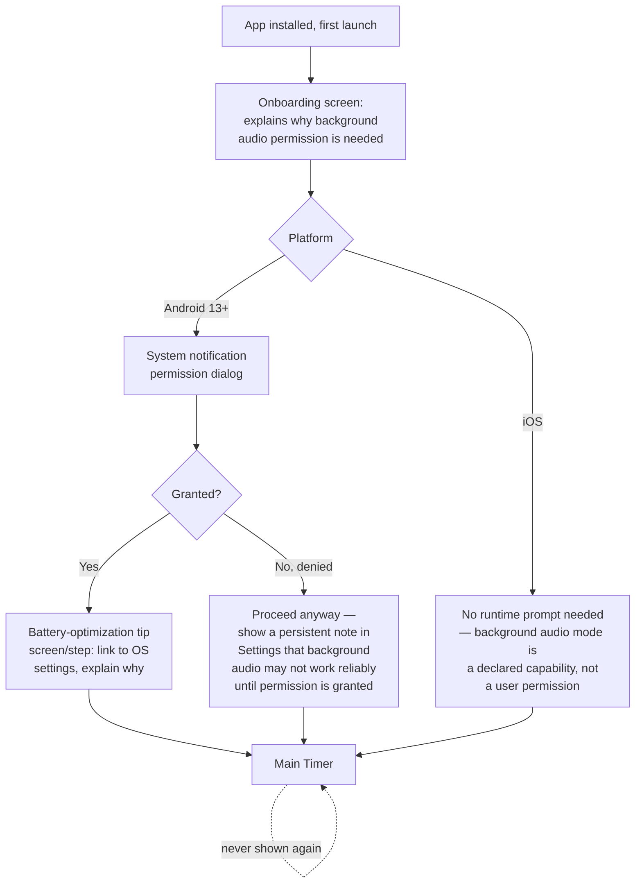
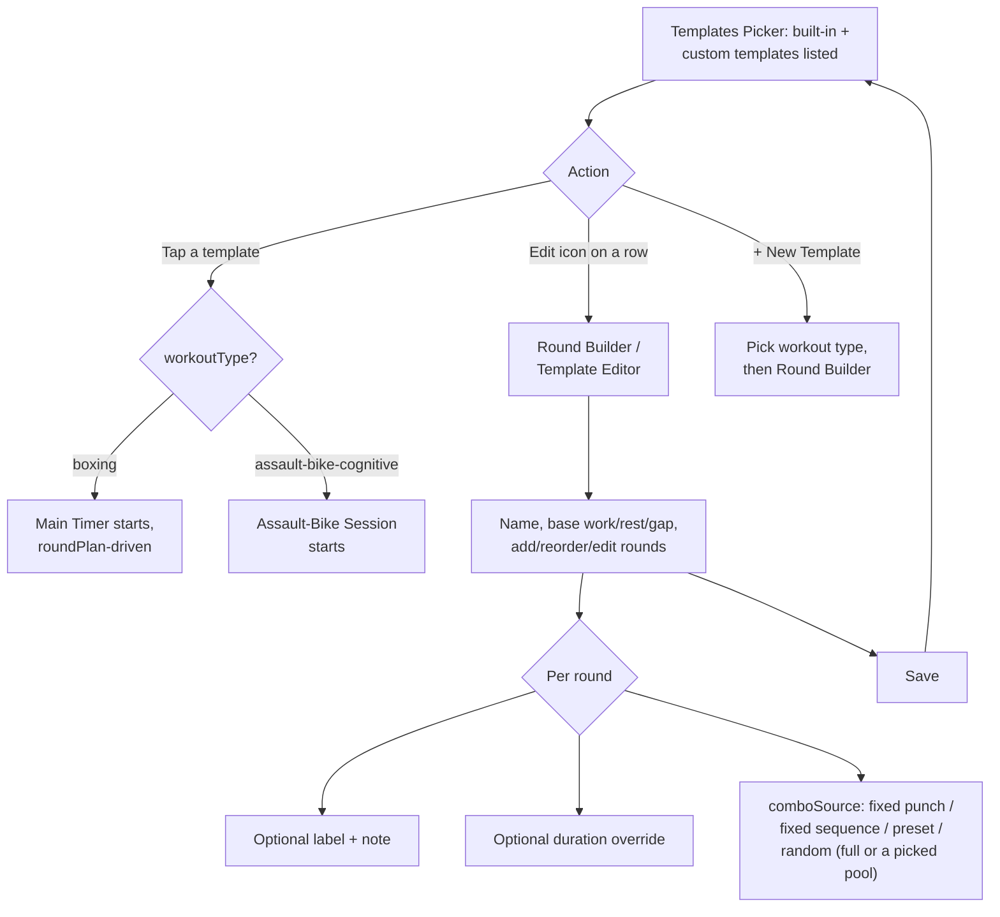

# Cornerman — User Flows

Status: confirmed with user, 2026-08-23. Source:
[docs/PRD.md](PRD.md) (use cases, single user type) and
[ARCHITECTURE.md](../ARCHITECTURE.md) (entities, no auth/accounts in v1).

There is one user type (PRD §2 — solo user, no accounts), so this document
has one flow section rather than one per user type. **No auth gates
exist anywhere in this app** — there's no login, so `security-baseline`'s
session/auth checklist doesn't apply here; the closest equivalent is the
OS-level permission gate covered in the onboarding flow below.

---

## Screen inventory (10 screens total)

1. **Onboarding** (first launch only, never shown again after)
2. **Main Timer** (home — the screen you land on every subsequent launch)
3. **Settings**
4. **Punches** (editor/list — reachable in both Random and Preset mode, see §3 below)
5. **Presets — List**
6. **Presets — Editor** (create/edit one preset's sequence)
7. **Templates — Picker** *(Phase 10+, added 2026-08-23)*
8. **Templates — Editor / Round Builder** *(Phase 10+)*
9. **Assault-Bike Session** *(Phase 11+ — a second "Main Timer"-equivalent, distinct screen since the boxing round-lights/combo-card don't fit this workout type)*
10. *(Implicit)* system permission dialogs (OS-native, not app screens, but part of the onboarding flow)

## Navigation convention

**Stack navigation with header back arrows, no tab bar.** A single-purpose
app with one home screen doesn't need persistent tab chrome (matches the
"low chrome" UX floor rule) — Settings and its sub-screens are reached by
drilling in and backing out. The gear icon on Main Timer is the sole entry
point into Settings, same as the old app's nav-entry-point count, just
routed to a pushed screen instead of a sheet overlay (per your call to
make Settings a full screen).

```
Onboarding (first launch only)
    │
    ▼
Main Timer ──(gear icon)──▶ Settings ──▶ Punches
    │  ▲                        │
    │  │                        ▼
    │  └────────────────  Presets List ──▶ Preset Editor
    │       (back navigation only, no other paths)
    │
    └──(Templates action)──▶ Templates Picker ──▶ Round Builder
                                    │  (edit)
                                    │ (select a boxing template → start)
                                    ▼
                              Main Timer (running, roundPlan-driven)

                              Templates Picker
                                    │ (select an assault-bike template → start)
                                    ▼
                              Assault-Bike Session (running)
```

*(Phase 10+, added 2026-08-23)* Templates is a second entry point off
Main Timer, alongside the existing gear icon — purely additive, the
existing Settings-driven quick-start flow is untouched. Selecting a
template starts the matching session type directly (no forced
preview-before-start step, per the one-obvious-primary-action rule);
editing is a separate explicit action per template row.

---

## Flow 1 — First launch / onboarding

**New requirement, doesn't exist in the old app** — driven directly by
the background-audio decision (`ARCHITECTURE.md`).



**Proposed default, flag if wrong:** a denied notification permission
does **not** block the app — it degrades to foreground-only operation
with a visible note in Settings (not a hard error), consistent with the
"fail gracefully, don't block" pattern already used for OS-level TTS
voice limitations in `ARCHITECTURE.md`'s edge cases.

---

## Flow 2 — Configure and run a timed round session (the core use case)

```
Main Timer (Ready state, default or last-used settings)
    │ tap Start
    ▼
Main Timer (Work phase) ⇄ Main Timer (Rest phase)  [cycles per round count]
    │ all rounds complete
    ▼
Main Timer (Finished state)
    │ tap Reset
    ▼
Main Timer (Ready state)
```

**States on the Main Timer screen itself** (not separate screens — same
inventory as the old app: round-progress lights, phase badge, countdown,
round counter, combo card, combo-count stat, Reset/Start-Pause/Settings
row):

- **Ready** — default/empty state before a session starts. First-ever
  launch shows this with seeded default punches/settings (no user data
  yet, per PRD §4's "start fresh" decision).
- **Work / Rest** — active countdown, spoken combos on Work phase.
- **Paused** — either user-initiated, or auto-paused by a call/audio-focus
  interruption (per PRD §7 — resumes automatically, exact remaining time
  preserved).
- **Finished** — all rounds complete; only real action is Reset.
- **Error — audio engine failed to initialize** (new edge case, no
  equivalent in the old app's simpler Web Audio setup): **proposed
  default** — the timer still runs visually (countdown, phase
  transitions) even if sound genuinely cannot start, with a small
  persistent banner ("Sound unavailable — check volume/permissions")
  rather than blocking the whole session. Flag if you'd rather this
  block Start entirely until resolved.

**Primary action check (UX floor):** Ready state's one obvious action is
Start — pass. Finished state's one obvious action is Reset — pass.

---

## Flow 3 — Adjust settings

```
Main Timer → (gear icon) → Settings
```

Settings screen sections, **same confirmed order as the old app**
(extraction doc §1.14), adapted for a full screen instead of a sheet:

Round → Mode → Sounds (bell/clapper choice + **new independent in-app
volume slider**, PRD §3.4) → Combinations (summary row → Presets List,
shown only when Mode = Preset) → Combo Timing (gap range + **new 0.25x–4x
speech rate dial**, always visible — revised down from 5x, see
`PROJECT_FACTS.md`) → Punches (summary row → Punches
screen, **now reachable in both modes** per your fix above, not hidden in
Preset mode).

**Empty/error states on Settings itself:** none — it's just a form; no
network calls, so no loading/error state at this level (all async work
happens on the Punches screen where TTS generation occurs).

---

## Flow 4 — Manage punches (with the new TTS-fallback requirement)

```
Settings → Punches
```

```mermaid
flowchart TD
    A[Punches screen: list of\nexisting punches] --> B{Action}
    B -->|Add new / rename| C[Enter punch name]
    C --> D{VoiceClip exists\nfor this name?}
    D -->|Yes, bundled| E[Saved immediately]
    D -->|No| F[Loading state:\n\"Generating voice clip...\"\n— one-time on-device TTS synthesis]
    F --> G{Synthesis succeeded?}
    G -->|Yes| H[Cached as VoiceClip,\nsaved]
    G -->|No| I[Error state: \"Couldn't\ngenerate audio for this\nname — try again\" + retry]
    B -->|Delete| J{Is this the last\nremaining punch?}
    J -->|Yes| K[Blocked: \"At least one\npunch is required\" —\nRandom mode has nothing\nto draw from otherwise]
    J -->|No| L[Deleted]
```

**Empty state:** cannot actually occur post-install since defaults are
seeded (PRD §4 — fresh defaults, not empty), but the delete-guard above
prevents a user from reaching a true zero-punch state, which would
silently break Random-mode combo generation.

---

## Flow 5 — Manage presets

```
Settings → Presets List → (tap existing, or "+ New") → Preset Editor
```

- **Presets List empty state:** first time in Preset mode with zero
  presets saved — shows a clear "No presets yet" message with a
  prominent "+ New Preset" action (one obvious primary action, per the
  UX floor).
- **Preset Editor:** name field + sequence builder (pick punches in
  order from the current Punches list, reorder, remove, save). Since
  sequences reference punch *numbers* resolved at call time (extraction
  doc §1.5), a preset referencing a since-deleted punch number falls back
  to a generic "Punch N" label rather than erroring — same as the old
  app, still correct behavior here.
- **Error state:** local save failure (rare, no network involved) —
  generic "Couldn't save, try again" — proportionate given this is
  on-device storage, not a remote call.

---

## Flow 6 — Workout templates *(Phase 10+, added 2026-08-23)*

```
Main Timer → (Templates action) → Templates Picker
```



- **Templates Picker empty-ish state:** the 4 built-ins (Relax,
  Moderate, Intense, Assault Bike Cognitive) always exist — there's no
  true empty state, but a first-time user sees only built-ins until they
  create a custom one.
- **Round Builder is inline, not a per-round sub-screen:** each round is
  an expandable card in one scrollable list (add/reorder/remove/edit
  in place) — matches the "low chrome, progressive disclosure" rule
  rather than forcing a drill-down per round, which would turn a
  10-round program into 10 extra screen transitions.
- **Selecting a template starts it directly** (no forced preview step,
  per the one-obvious-primary-action rule) — editing is a distinct,
  explicit action on the row, not something you pass through on the way
  to starting.
- **Error state:** local save failure on the Round Builder — same
  generic "Couldn't save, try again" as Preset Editor, same reasoning
  (on-device storage, not a remote call).
- **A round's `comboSource: preset` referencing a since-deleted preset**
  falls back the same way a deleted punch number does — generic label,
  never an error (consistent with the existing resolve-at-call-time
  pattern, extraction doc §1.5).

---

## Flow 7 — Assault-Bike Cognitive session *(Phase 11+)*

```
Templates Picker → (assault-bike template) → Assault-Bike Session
```

```mermaid
flowchart TD
    A[Work phase: 10s\nall-out countdown] --> B[Rest: Settle\n0-8s, just breathe]
    B --> C[Rest: Cognitive Drill\n~30s]
    C --> D{drillMode}
    D -->|visual| E[Odd-One-Out grid:\ntap the different tile,\nreaction time shown live]
    D -->|auditory| F[Corner Commands:\nspoken cue, quick\nshadow-response window\n— reuses the Phase 5\nspeech pipeline]
    E --> G[Rest: Reset\n~12s, \"get ready\"]
    F --> G
    G --> A
    A -.all rounds complete.-> H[Finished]
```

- **This screen is visually distinct from the boxing Main Timer** —
  round-progress lights and the combo card don't apply here; the work
  phase is a stark countdown, the drill phase is the one moment this
  mode asks for eyes-on-screen attention (unlike the boxing flow's
  audio-first, mostly-eyes-off pattern).
- **No data is logged.** Reaction time/accuracy shown during the drill
  is live-only and disappears once the round ends — matches the
  confirmed "no bike integration, no stats tracking" scope.
- **Empty/error state:** none beyond what Phase 6/7's audio-engine error
  banner already covers (sound-unavailable degrades the same way here
  as on the boxing timer).

---

## UX floor check (Step 2b)

- **One obvious primary action per screen:** Onboarding (grant/continue),
  Main Timer Ready (Start), Main Timer Finished (Reset), Punches empty
  guard (can't reach empty), Presets List empty (+ New Preset), Templates
  Picker (tap a template to start) — all pass.
- **Nothing requires remembering a prior screen:** preset sequences show
  live punch names, not raw numbers; Settings summary rows show current
  values (e.g. "3 presets") rather than requiring recall; a running
  round-plan session shows the current round's label/note on screen
  rather than expecting the user to remember what they programmed — pass.
- **Step count honesty:** starting a session with existing settings is
  still one tap (Start) from Main Timer, and starting a template is one
  tap from Templates Picker — the added screens (Onboarding, Punches,
  Presets List/Editor, Round Builder) are all *configuration* paths, not
  on the critical path to starting a workout — pass.
- **Progressive disclosure:** Punches/Presets pulled into their own
  sub-screens specifically so Settings itself stays scannable — this was
  the point of making that call above.
- **Empty/loading/error states designed for every screen:** covered above
  for every screen with real async work (Punches' TTS generation is the
  only genuinely async, failable operation in the whole app).

---

## Handoff

`docs/user-flows.md` is written. Per the workflow, next is the
**design-direction step** — `/impeccable init` (translates `docs/PRD.md`
into `PRODUCT.md` without re-interviewing), then `/impeccable new-work`
to actually decide the visual world — since the full screen list now
exists and no component has been built yet to inherit a default look.
After that comes `roadmap-planner`, which will use the screen
dependencies mapped here (e.g. Onboarding must exist before Main Timer
is reachable) to sequence phases correctly.
