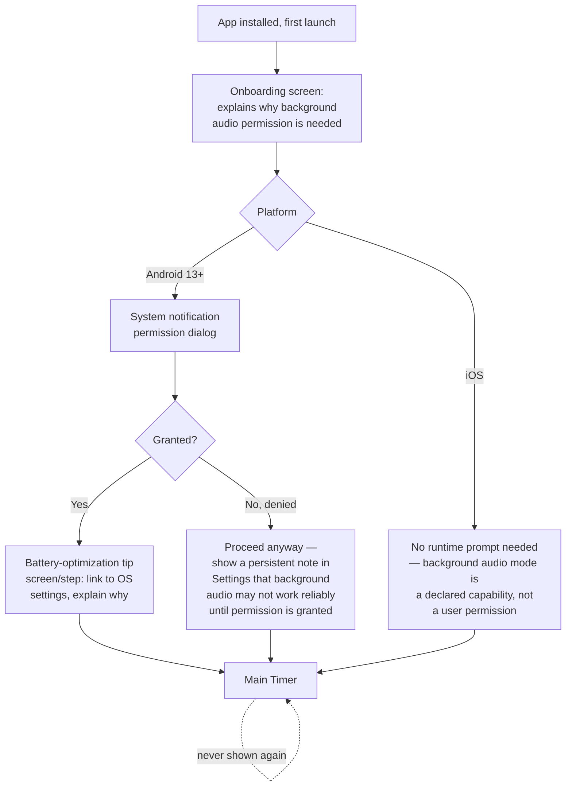

# Cornerman — User Flows

Status: confirmed with user, 2026-08-23. Source:
[docs/PRD.md](PRD.md) (use cases, single user type) and
[ARCHITECTURE.md](../ARCHITECTURE.md) (entities, no auth/accounts in v1).

There is one user type (PRD §2 — solo user, no accounts), so this document
has one flow section rather than one per user type. **No auth gates
exist anywhere in this app** — there's no login, so `security-baseline`'s
session/auth checklist doesn't apply here; the closest equivalent is the
OS-level permission gate covered in the onboarding flow below.

---

## Screen inventory (7 screens total)

1. **Onboarding** (first launch only, never shown again after)
2. **Main Timer** (home — the screen you land on every subsequent launch)
3. **Settings**
4. **Punches** (editor/list — reachable in both Random and Preset mode, see §3 below)
5. **Presets — List**
6. **Presets — Editor** (create/edit one preset's sequence)
7. *(Implicit)* system permission dialogs (OS-native, not app screens, but part of the onboarding flow)

## Navigation convention

**Stack navigation with header back arrows, no tab bar.** A single-purpose
app with one home screen doesn't need persistent tab chrome (matches the
"low chrome" UX floor rule) — Settings and its sub-screens are reached by
drilling in and backing out. The gear icon on Main Timer is the sole entry
point into Settings, same as the old app's nav-entry-point count, just
routed to a pushed screen instead of a sheet overlay (per your call to
make Settings a full screen).

```
Onboarding (first launch only)
    │
    ▼
Main Timer ──(gear icon)──▶ Settings ──▶ Punches
    ▲                           │
    │                           ▼
    └───────────────────  Presets List ──▶ Preset Editor
        (back navigation only, no other paths)
```

---

## Flow 1 — First launch / onboarding

**New requirement, doesn't exist in the old app** — driven directly by
the background-audio decision (`ARCHITECTURE.md`).



**Proposed default, flag if wrong:** a denied notification permission
does **not** block the app — it degrades to foreground-only operation
with a visible note in Settings (not a hard error), consistent with the
"fail gracefully, don't block" pattern already used for OS-level TTS
voice limitations in `ARCHITECTURE.md`'s edge cases.

---

## Flow 2 — Configure and run a timed round session (the core use case)

```
Main Timer (Ready state, default or last-used settings)
    │ tap Start
    ▼
Main Timer (Work phase) ⇄ Main Timer (Rest phase)  [cycles per round count]
    │ all rounds complete
    ▼
Main Timer (Finished state)
    │ tap Reset
    ▼
Main Timer (Ready state)
```

**States on the Main Timer screen itself** (not separate screens — same
inventory as the old app: round-progress lights, phase badge, countdown,
round counter, combo card, combo-count stat, Reset/Start-Pause/Settings
row):

- **Ready** — default/empty state before a session starts. First-ever
  launch shows this with seeded default punches/settings (no user data
  yet, per PRD §4's "start fresh" decision).
- **Work / Rest** — active countdown, spoken combos on Work phase.
- **Paused** — either user-initiated, or auto-paused by a call/audio-focus
  interruption (per PRD §7 — resumes automatically, exact remaining time
  preserved).
- **Finished** — all rounds complete; only real action is Reset.
- **Error — audio engine failed to initialize** (new edge case, no
  equivalent in the old app's simpler Web Audio setup): **proposed
  default** — the timer still runs visually (countdown, phase
  transitions) even if sound genuinely cannot start, with a small
  persistent banner ("Sound unavailable — check volume/permissions")
  rather than blocking the whole session. Flag if you'd rather this
  block Start entirely until resolved.

**Primary action check (UX floor):** Ready state's one obvious action is
Start — pass. Finished state's one obvious action is Reset — pass.

---

## Flow 3 — Adjust settings

```
Main Timer → (gear icon) → Settings
```

Settings screen sections, **same confirmed order as the old app**
(extraction doc §1.14), adapted for a full screen instead of a sheet:

Round → Mode → Sounds (bell/clapper choice + **new independent in-app
volume slider**, PRD §3.4) → Combinations (summary row → Presets List,
shown only when Mode = Preset) → Combo Timing (gap range + **new 0.25x–5x
speech rate dial**, always visible) → Punches (summary row → Punches
screen, **now reachable in both modes** per your fix above, not hidden in
Preset mode).

**Empty/error states on Settings itself:** none — it's just a form; no
network calls, so no loading/error state at this level (all async work
happens on the Punches screen where TTS generation occurs).

---

## Flow 4 — Manage punches (with the new TTS-fallback requirement)

```
Settings → Punches
```

```mermaid
flowchart TD
    A[Punches screen: list of\nexisting punches] --> B{Action}
    B -->|Add new / rename| C[Enter punch name]
    C --> D{VoiceClip exists\nfor this name?}
    D -->|Yes, bundled| E[Saved immediately]
    D -->|No| F[Loading state:\n\"Generating voice clip...\"\n— one-time on-device TTS synthesis]
    F --> G{Synthesis succeeded?}
    G -->|Yes| H[Cached as VoiceClip,\nsaved]
    G -->|No| I[Error state: \"Couldn't\ngenerate audio for this\nname — try again\" + retry]
    B -->|Delete| J{Is this the last\nremaining punch?}
    J -->|Yes| K[Blocked: \"At least one\npunch is required\" —\nRandom mode has nothing\nto draw from otherwise]
    J -->|No| L[Deleted]
```

**Empty state:** cannot actually occur post-install since defaults are
seeded (PRD §4 — fresh defaults, not empty), but the delete-guard above
prevents a user from reaching a true zero-punch state, which would
silently break Random-mode combo generation.

---

## Flow 5 — Manage presets

```
Settings → Presets List → (tap existing, or "+ New") → Preset Editor
```

- **Presets List empty state:** first time in Preset mode with zero
  presets saved — shows a clear "No presets yet" message with a
  prominent "+ New Preset" action (one obvious primary action, per the
  UX floor).
- **Preset Editor:** name field + sequence builder (pick punches in
  order from the current Punches list, reorder, remove, save). Since
  sequences reference punch *numbers* resolved at call time (extraction
  doc §1.5), a preset referencing a since-deleted punch number falls back
  to a generic "Punch N" label rather than erroring — same as the old
  app, still correct behavior here.
- **Error state:** local save failure (rare, no network involved) —
  generic "Couldn't save, try again" — proportionate given this is
  on-device storage, not a remote call.

---

## UX floor check (Step 2b)

- **One obvious primary action per screen:** Onboarding (grant/continue),
  Main Timer Ready (Start), Main Timer Finished (Reset), Punches empty
  guard (can't reach empty), Presets List empty (+ New Preset) — all pass.
- **Nothing requires remembering a prior screen:** preset sequences show
  live punch names, not raw numbers; Settings summary rows show current
  values (e.g. "3 presets") rather than requiring recall — pass.
- **Step count honesty:** starting a session with existing settings is
  still one tap (Start) from Main Timer — the added screens (Onboarding,
  Punches, Presets List/Editor) are all *configuration* paths, not on the
  critical path to starting a workout — pass.
- **Progressive disclosure:** Punches/Presets pulled into their own
  sub-screens specifically so Settings itself stays scannable — this was
  the point of making that call above.
- **Empty/loading/error states designed for every screen:** covered above
  for every screen with real async work (Punches' TTS generation is the
  only genuinely async, failable operation in the whole app).

---

## Handoff

`docs/user-flows.md` is written. Per the workflow, next is the
**design-direction step** — `/impeccable init` (translates `docs/PRD.md`
into `PRODUCT.md` without re-interviewing), then `/impeccable new-work`
to actually decide the visual world — since the full screen list now
exists and no component has been built yet to inherit a default look.
After that comes `roadmap-planner`, which will use the screen
dependencies mapped here (e.g. Onboarding must exist before Main Timer
is reachable) to sequence phases correctly.
